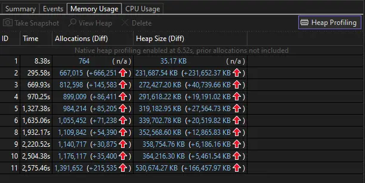
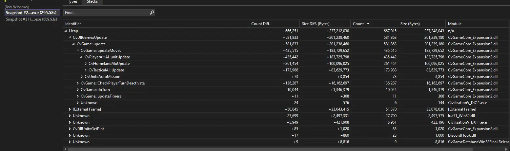
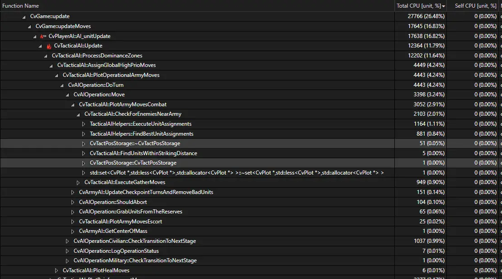

## How can I build the GameCoreDLL

* Install the git command line client and make sure it's in your path (it is needed for a pre-build script to run).
* Clone the repo. The Visual Studio solution file `VoxPopuli_vs2013.sln`` is included in the repository folder
* Significant portions of the mods are Lua / SQL / XML files. Those can be modified without rebuilding the game core
* You need the Visual C++ 2008 SP1 (VC9) toolset to actually link the resulting game core DLL.
  * The SP1 is important, else you get errors that STL headers like `<array>` are missing. Try the internet archive ...
  * It is possible to use a recent IDE like Visual Studio 2022 Community, just make sure to use the correct toolset
    * If you get errors that the VC9 toolset cannot be found, install Visual C++ 2010 (not logical but true)
  * It's best to install different Visual Studio editions in chronological order, eg 2008 before 2019
* If prompted on loading the solution file whether you want to retarget projects, select "No Upgrade" for both options and continue
* If you encounter an "unexpected precompiler header error", install [this hotfix](http://thehotfixshare.net/board/index.php?autocom=downloads&showfile=11640)
* A tutorial with visual aids has been posted [here](https://forums.civfanatics.com/threads/how-to-compile-the-vox-populi-dll.665916/), courtesy of ASCII Guy
* To build the 43 Civ version of the DLL:
  * Open the file `Community-Patch-DLL\CvGameCoreDLLUtil\include\CustomModsGlobal.h`
  * Remove everything **before** the `#` in this line: `// #define MOD_GLOBAL_MAX_MAJOR_CIVS (43)`
  * Save the file.
* If building the Release version, Whole Program Optimization is enabled, which will cause a several minute delay at the end of pass 1, but the compiler is still functioning!
  * You can disable Whole Program Optimization locally under Project > VoxPopuli Properties > C/C++ > Optimization > Whole Program Optimization (set it to No)
* If the compiler stops responding at the end of pass 2, try deleting the hidden .vs folder as well as the BuildOutput/BuildTemp folders in the project directory, then reopening the solution file.
* There is also clang-based build script now!

## How do I debug this

### To enable logging (for bug reports)
[This thread](https://forums.civfanatics.com/threads/how-to-enable-logging.487482) is useful for basic understanding of how logging works, down there is below and for more serious bug reports!
	
* Logs provide some useful information on AI decisions and other problems
* Logging can be enabled in `My Games\Sid Meier's Civilization V\config.ini`
* Set the following options to 1:
  * `ValidateGameDatabase`
  * `LoggingEnabled`
  * `MessageLog`
  * `AILog`
  * `AIPerfLog`
  * `BuilderAILog`
  * `PlayerAndCityAILogSplit`
* Make sure to save your changes! Enabling logging only needs to be done once every time the game is installed.
* The log files will now be written to `My Games\Sid Meier's Civilization V\Logs`
  * Place them in a `.zip` file and attach them to your bug report!

### To debug the GameCoreDLL
* Use Visual Studio to build the `DEBUG` configuration of the project (as opposed to the `RELEASE` config)
* Place the generated `.dll` and `.pdb` file (from the `BuildOutput` folder) in the mods folder (Community Patch Core), replacing the dll there.
* Start Civ V and load the mod
* Make sure Visual Studio is open with the solution file loaded
* In the Visual Studio debugger menu select "Attach to process" and pick `Civilization5.exe`
* Start the game. In case it crashes the debugger will show you where and why.
  * It may be you only see an address, no code. In that case the crash is outside of the game core dll ...
  * However it may still be possible to learn something from the callstack!
* You do not have to play yourself - the FireTuner from the Civ V SDK has an autoplay feature under the Game tab, so you can lean back and watch the AI
  * You must first enable the tuner in `My Games\Sid Meier's Civilization V\config.ini` (first option)
* You can also set (conditional) breakpoints in the code to inspect the value of interesting variables.
  * It is useful to place breakpoints where bugged functions are called, as you will see the callstack leading to that function call, and the value of the variables passed to it
* Do not make changes to the code while the mod is running, this will desync the debugger
* You may encounter benign exceptions, usually soon after beginning the debugging process
  * An example of this is an error informing you that a PDB file was not found.
  * These are nothing to worry about, you only want to catch unhandled exceptions (i.e. crashes)
  * If you encounter these exceptions, uncheck the box labelled "Break when this exception is thrown"
  * Then detach the debugger and reattach it to the process to resume debugging. You may have to do this a few times

## How do I use Visual Studio 2022 Diagnostic Tools

It is possible to use available out-of-box Diagnostic Tools to measure DLL performance.
The things which you can do is profiling memory usage and profiling CPU performance.

### Profiling memory

To start with profiling memory, firstly follow the steps above to start a debug session.
When you have debug session started:
- Use Visual Studio shortcut Ctrl + T to open search bar and switch to "Feature Search".
- Type "Diagnostic Tools" to find the appropriate window.
- You will see window with graphs and with some tabs below.
- Click at "Summary" tab, press "Enable heap profiling".
- Go to "Memory Usage" tab and press "Take Snapshot" when you need to capture current
  memory allocations.
- Taken snapshot will appear below and now you are able to click there to investigate
  memory allocations. You also can click on text in "Heap Diff" column to view diff
  with previous snapshot (if any). Doing so you will easily find how much memory DLL 
  uses and find possible leaks.

How it looks like. Summary view:

Details view:

### Profiling CPU

CPU profiling will help you find the most "heavy" (in terms of time) functions. To start
with profiling CPU performance, start a debug session and open "Diagnostic Tools". Then
do the following:
- Open "Summary" tab. When you will be ready to start CPU profiling, press 
  "Record CPU profile". Time range on the graph will be colored in green if CPU 
  profiling was enabled there.
- When you finished with profiling and you want to investigate your results, switch to
  the "CPU Usage" tab, disable "Record CPU profile" button and click on text "Break All"
  to break application.
- Select the time range which you want to investigate right on graph. Use "Zoom Out" 
  button if time range does not fit. 
- Under the "Categories" uncheck "UI", "Graphics" and "Runtime".
- Under the "Threads" uncheck all threads and leave only "CivilizationV_DX11.exe thread"
  selected (you can find its' id under the "Continue" button in main toolbar).
- Under the "Settings" uncheck "Show Just My Code", leave only "Show Native Code".
- Click on "Open details ..." text and select "Modules" as current view.
- Now you can expand `cvgamecore_expansion2` and there you will notice all the data you 
  need. There you can navigate between functions, switch between different views and so 
  on.

How it looks like:

