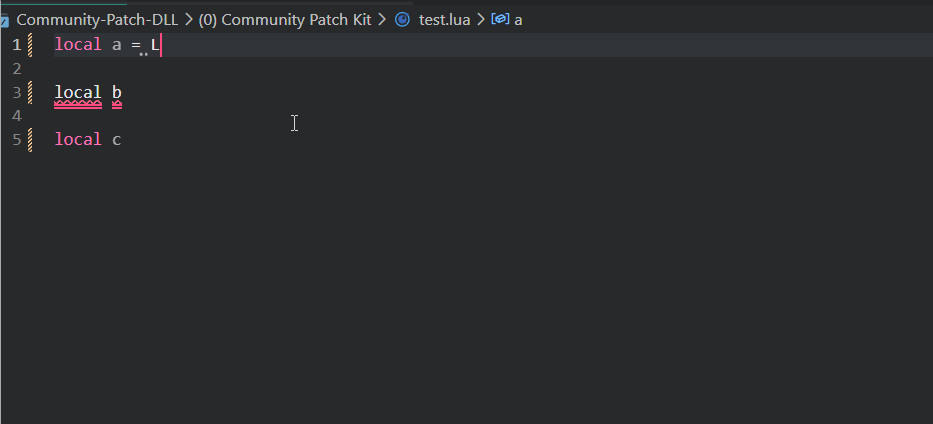

# Readme

*Files from this directory should not be included in `VFS`.*

Purpose of this files is like with `.h` or `.d.ts` files, but just to add type safety and documentation to lua code in Civ5. If you touch some files or have some knowledge about builtin globals or any custom functionality please add type declarations using `LuaCATS` anotations here or within touched code. This will simplify further Civ5 mods development, and reduce the amount of bugs.

# How it works

# [Installation](https://luals.github.io/#vscode-install)

# [How to use LuaCATS](https://luals.github.io/wiki/annotations/)

# Meta files
* [Declaration files](https://luals.github.io/wiki/definition-files/)
* [Meta Annotation](https://luals.github.io/wiki/annotations/#meta)
